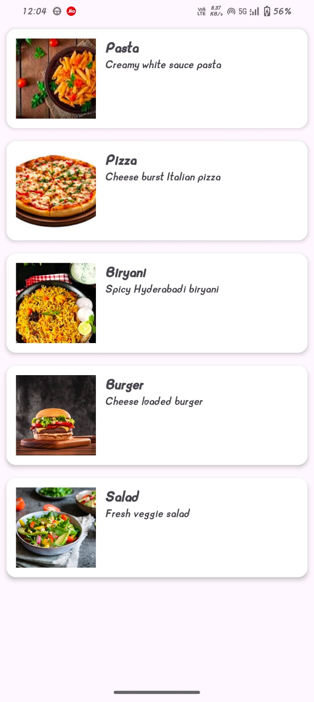

# 🍲 RecipeScroller App

A simple Recipe Scroller App built in Android (Kotlin + XML) to practice RecyclerView with images and descriptions.

The app displays a list of recipes, each with an image and a short description, helping me understand how to handle custom layouts in RecyclerView.

# 🚀 Features

Scrollable list of recipes

## Each recipe contains:

- 🍽️ Title

- 📝 Short description

- 🖼️ Image (loaded from resources)

Implemented using RecyclerView + Adapter

Custom row layout for recipe items

# 🛠️ Tech Stack

Language: Kotlin

UI: XML Layouts

Core Android Concepts:

RecyclerView & ViewHolder

Custom Adapter (RecipeAdapter)

Binding text + images together

Data class (Recipe)

# 📂 Project Structure

├── MainActivity.kt                 # Sets up RecyclerView

├── Recipe.kt                       # Data class representing a recipe

├── RecipeAdapter.kt                # RecyclerView Adapter

└── res/layout/                     

      ├── activity_main.xml         # Main layout
      
      └── item_recipe.xml           # Layout for a single recipe row (image + text)
      
└── res/drawable/                   # Recipe images

# 📸 Screenshots 

### RECIPEE SCROLLER SCREEN

	
# 📖 Learning Outcome

This project helped me practice:

Implementing RecyclerView with multiple views (image + text)

Creating a custom adapter for complex layouts

Designing item layouts with ConstraintLayout / LinearLayout

Using a data class (Recipe) to store multiple properties

# ⚡ How to Run

Clone this repository  https://github.com/suhaniranka006/Recipe_Scroller_App.git

Open in Android Studio

Run the app on an emulator or physical device

# 🙌 Future Improvements

Add click listeners to open detailed recipe view

Fetch recipe data dynamically (e.g., from an API)

Improve UI with CardView + Material Design
